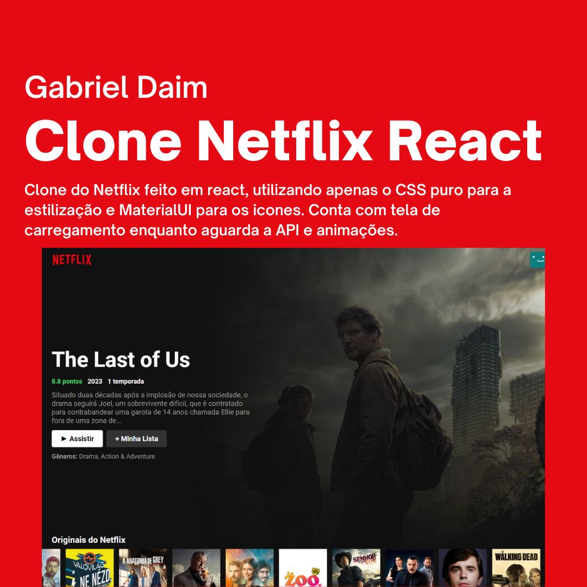

<h1 align="center"> Projeto Clone do Netflix </h1>

  <a href="#-tecnologias">Tecnologias</a>&nbsp;&nbsp;&nbsp;|&nbsp;&nbsp;&nbsp;
  <a href="#-Instruções">Instruções</a>&nbsp;&nbsp;&nbsp;|&nbsp;&nbsp;&nbsp;
  <a href="#memo-licença">Licença</a>&nbsp;&nbsp;&nbsp;|&nbsp;&nbsp;&nbsp;
  <a href="#autor">Autor</a>

  

 

  

## 🚀 Tecnologias

Esse projeto foi desenvolvido com as seguintes tecnologias:

- HTML e CSS
- Git e Github
- JavaScript
- React

**O que usamos nesse projeto:**

- Organização de Github, readme, imagens, hacks para tabela de readme
- Front-end construido com React
- Uso de ícones e fontes customizdas
- HTML: `header`,`main`,`section`,`select`,`img`,
- CSS: `all`, `overflow`, `::before`, `::after`, `rem`, `position`, `fit-content`, `flex e grid`, `@media`, `responsividade`
- JavaScript: `DOM`,`React`, `Animações`
- API: Consumindo a API TheMovieDB

## 🔖 Instruções

**Para rodar o projeto localmente:**

- npm run dev 
- Mas se preferir, o deploy já foi realizado em: https://clone-netflix-react-nine.vercel.app/

## :memo: Licença

Esse projeto está sob a licença MIT.

## Autor

Feito com 💜 por Gabriel Daim
